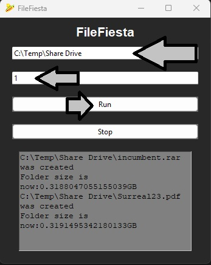

# File-Fiesta

Creating realistic test and training environments for file share systems!

# Purpose

When building a training environment it is important to be as accurate as possible to production. One important thing to train on is the building, maintenance, recovery, migration, and decommissioning of a corporation's file share. However, you don’t “normally” want real corporate data in the training environment. How do you simulate managing files without data that takes up real drive space? 

File-Fiesta is here to help you! It is a simple EXE that will generate different files filled with random data. All you need to do is point it at the directory you need filled, set a soft data size limit, and watch it go.

This helps make the training environment feel more realistic without having to move a large amount of data into it. 

Need to see how long it will take for a transfer to complete in a test? File-Fiesta will help you simulate the data size with randomly generated files! Want to make training realistic by making your students backup and restore a large file share? File-Fiesta will make it seem real without risking important data!

# Build Methodology

This project is designed to be small (35MB roughly) so you don't need to migrate allot of data into your training environments. Instead you can just create it. File-Fiesta requires three files in the same directory to run properly. 

- File Fiesta.exe
  - Main python executable
- Randomwords.txt
  - list of random words it uses to name the files
  - This file was kept seperate from the EXE so you can add/remove possible file names. Making customizable to your environment.
- sombrero_PNG7.png
  - Because you can't have a fiesta without it!
  - It also won't run without it....

If your cyber security people are worried about a random EXE you found on the internet making GBs or TBs of data in your systems the code is located in this REPO to ease their mind. 

# Usage

1. Move all three files(File Fiesta.exe, Randomwords.exe, sombrero_PNG7.png) to the file share you want to create files on.

  

2. Run "File Fiesta.exe"
    - Only two data points are required!
      - Entry field 1: The directory you want the files created in.
      - Entry Field 2: The desired size of the directory in GB. If you want roughly 1GB of random files enter "1".
        - The file size is a soft limit. It may be a bit high or low of 1GB due to the random file sizes. It is recommeded that you leave 10% of disk space on the primay OS drive, and 2-3% on a secondary data drive. 
    - Click the Run Button.

  

3. View the results

  - You will see the name of the ramdom files being created in the message block at the bottom of the application. 

  

  - Once the files are created feel free to move them around, rename them, or whatever is needed to make a more convicint environment.

  

# Support 

This repository is currently maintained by a single IT. Please consider sponsoring 404Staging to help maintain this project and others.
